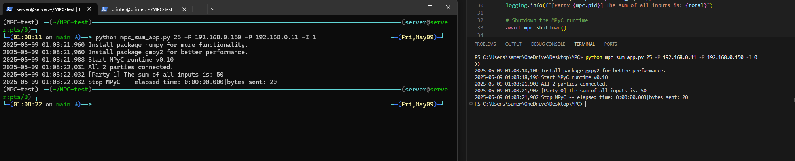

Du måste tillåta kommunikation på port 7070, och om du stänger av brandväggen så fungerar det också bra

Kör skriptet med PowerShell som administratör med kommandot ./allow-comucation-win.ps1 för att tillåta kommunikationen.

Därefter kan du bara köra skriptet med python3 mpc_sum_app.py.

ex:
PC1 "192.168.0.150" : python mpc_sum_app.py 25 -P 192.168.0.150 -P 192.168.0.11 -I 1
PC2 "192.168.0.11" : python mpc_sum_app.py 25 -P 192.168.0.11 -P 192.168.0.150 -I 0

– Du kan hämta IP-adresserna från en fil eller något liknande, men just nu vill jag bara få det att fungera.
– jag testade med två och det fungerade. Jag tror att det kommer fungera likadant med fler datorer.
Viktigaste är:
den första IP-adressen i listan är IP:n för den dator du kör skriptet på – annars fungerar det inte.
Servern med -I 0 måste startas först, och sedan de andra. Det här är den ända sättet jag har fått att fungera.

